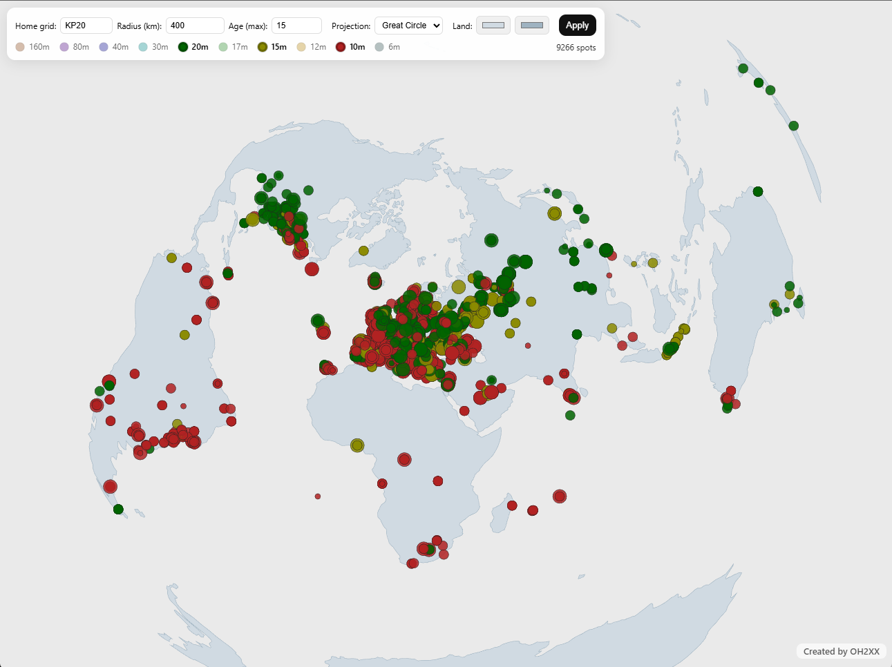

# PSK Prop Radius Map

A lightweight HF propagation viewer that listens to **PSKReporter via MQTT** and draws **band-colored spots** on an interactive world map (Robinson / Mercator / Great-circle AEQD).  
Built with **FastAPI** (backend) and **HTML5 Canvas + d3-geo** (frontend).



## What it shows

- **Sender spot:** the station at that location **transmitted** a signal that was **received within your selected radius** from your home grid.
- **Receiver spot:** the station at that location **received** a signal that was **transmitted from within your selected radius**.

Each **band** has its own color. **Dot size** reflects reported **SNR**: smaller for weak (e.g., ≤−20 dB), larger for strong (≥0 dB).

## Controls

- **Home grid** – Your Maidenhead locator (e.g., `KP20`). This centers AEQD and sets the seam/rotation for Robinson & Mercator.
- **Radius (km)** – The distance filter. Only traffic that **originates or terminates** within this radius of your home grid is shown (see “Sender/Receiver” above).
- **Age (max)** – Only show spots **up to this many minutes old**. Older spots are pruned automatically.
- **Projection** – Choose **Robinson** (default), **Mercator**, or **Great Circle (AEQD)**.
- **Band selection** – Click the **colored band buttons** in the legend to include/exclude bands.
- **Map colors** – Adjust the **land fill** and **outline** colors. Your choices persist locally.
- **Mouse** – **Wheel** to zoom; **drag** to pan. (Panning/zoom state is stored per projection.)

## Data source

This app consumes **PSKReporter** via **MQTT** (e.g., `mqtt.pskreporter.info:1883`) on filtered topics like `pskr/filter/v2/{band}/#`.  
It parses FT8/spot messages, determines **sender/receiver roles**, and **filters** by:
- selected **bands**
- **home grid** ± **radius**
- **age window** (last N minutes)

Please be mindful of **PSKReporter’s usage policies** and network load (keep filters tight and time windows modest).

## Install & run (Windows)

1. Copy config.example.json -> config.json
2. Edit "client_id" in config.json and change pskprop-YOURCALLSIGN to something unique
   (e.g. pskprop-OH2XXXX).


```powershell
py -3.11 -m venv .venv
.\.venv\Scripts\Activate.ps1
pip install -r requirements.txt
uvicorn app:app --host 0.0.0.0 --port 8080
